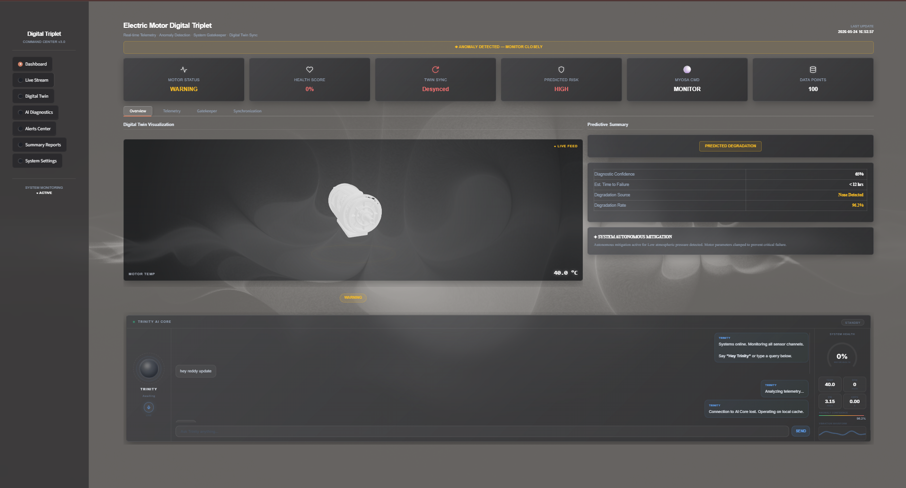
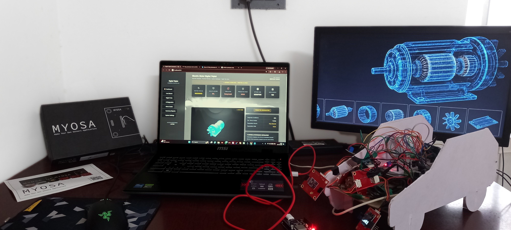
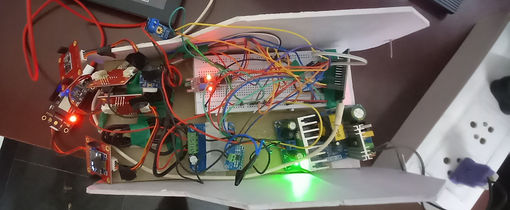
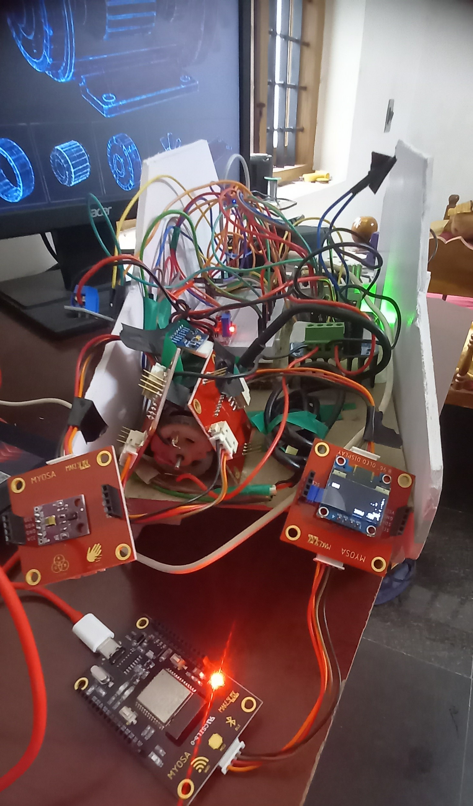
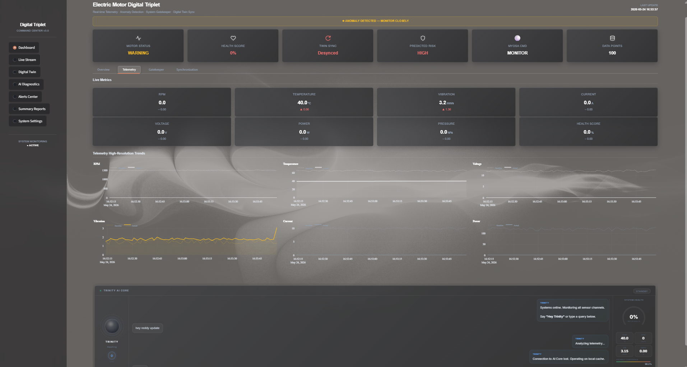

> AI-integrated industrial motor monitoring ecosystem with digital twin synchronization and predictive maintenance intelligence.

## Acknowledgements

## Overview

## Demo / Examples

### Images

 
<i>MYOSA Digital Triplet Dashboard</i>

 
<i>MYOSA Digital Triplet fullsystem</i>

 
<i>MYOSA Digital Triplet hardware</i>

 
<i>MYOSA Digital Triplet Dashboard</i>

 
<i>MYOSA Digital Triplet telemetry</i>

### Videos

- Local Repository Demo: [Watch Demo](videos/demo.mp4)
- Backup Drive Link: [Google Drive Video](https://drive.google.com/file/d/1IK0GVrevZfL-2KjDTvdgtj44JFnJ52pk/view?usp=drive_link)

## Features (Detailed)

## Usage Instructions

## Tech Stack

## Requirements / Installation

## File Structure

## License

## Contribution Notes
